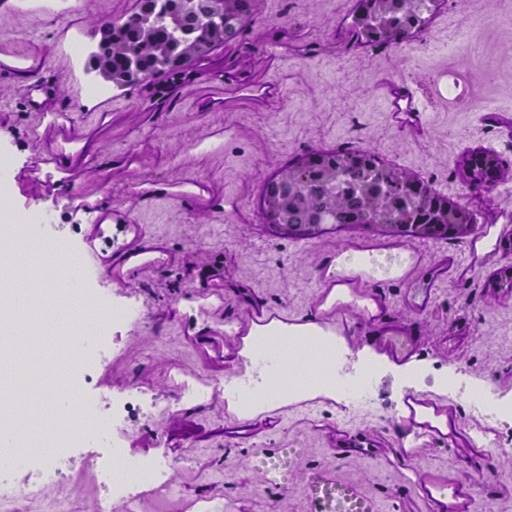
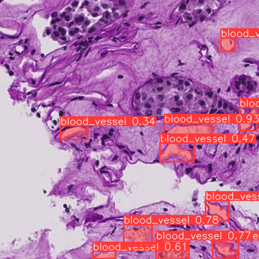

# Blood Vessel Segmentation Project

## Description
This project aims to build an automated system for segmenting blood vessels in scanned images. Blood vessel segmentation is the process of classifying and marking blood vessel regions in an image, separating them from other structures. We achieved the mAP50 score *0.58433*, compared to the best score of *0.589* in the Kaggle leaderboard https://www.kaggle.com/competitions/hubmap-hacking-the-human-vasculature/leaderboard

## Example with a image after prediction with model.
### Before prediction

### After prediction

## Demo
For a quick demo, please visit this website: `https://humanvasculature-fehopwpmus7frpakvv2ngt.streamlit.app/`.
You can upload an image in `.tif` format in the val dataset and see the result. Read the instructions for downloading data below.

## Data prepartion
1. File polygons.jsonl: `https://drive.google.com/file/d/145_7xXJ9_DzLrIGfO5AIXbyJoIYi7H9Z/view?usp=drive_link`.
2. Data to training model: `https://drive.google.com/file/d/1Ct4n8tp-G_X65xxt1x7fa1yUNj373s-p/view?usp=drive_link`.

## Installation
1. Install the Python environment using the `env.yaml` file. Run the following command to install: `conda env create -f env.yaml`
2. Activate the installed environment: `conda activate human_vasculature`
3. Install the required packages: `pip install -r requirements.txt`

## Usage
# Training
Steps:
1. Clone this repo.
2. Download data and extract to root folder of the project.
3. Set up the env as specified in installation.
4. Run `train_model.py` file.

# Inference
Steps:
1. Clone this repo
2. Download weights of the trained model: `https://drive.google.com/file/d/1xZL5HjrVFsp4Zu6osnc_btM1NfiBcoop/view?usp=drive_link`.
3. Set up the env as specified in installation.
4. Run `infer.py` file.

# Deploy the model with streamlit
1. To run the streamlit app locally: `streamlit run streamlit_app.py`.
2. To deploy the app on streamlit community cloud, follow the instructions: `https://docs.streamlit.io/streamlit-community-cloud/deploy-your-app`.

# Build Docker container
Steps: 
1. Run `docker build -t {image's name} .` to build Docker image.
2. Run `docker run -p {port} {image's name}` to build Docker container.

## Directory Structure
- `best.pt`: The weights of the best-trained model.
- `Dockerfile`: Configuration file for deploying the application using Docker.
- `env.yaml`: Environment file to create a conda environment.
- `example.py`: Example file containing functional code.
- `infer.py`: File containing functional code to predict and segment blood vessels on new images.
- `packages.txt`: List of required packages.
- `requirements.txt`: List of required packages and their versions.
- `streamlit_app.py`: File containing functional code to run the Streamlit application.
- `train_model.py`: File containing functional code to train the segmentation model.

## Contributing
If you would like to contribute to this project, please create a pull request and wait for feedback from the development team.

## Author
- Name: [Thanhvocam](https://github.com/thanhvocam/Human_vasculature.git)
- Email: thanhvocam94@gmail.com

## License
This project is licensed under the [MIT License](https://opensource.org/licenses/MIT).